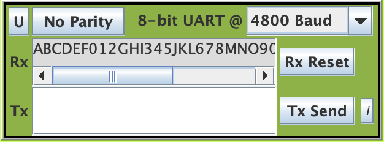

# Operating System 2019 Spring Checkpoint 04

## Preemptive Multithreading
For this programming project checkpoint, you are to test your preemptive multithreading and semaphore code by extending the classical bounded-buffer example to two producers and one consumer. The two producers will compete with each other for writing. 
You should make a new directory and copy the source files from the previous checkpoint. Make a copy of testpreempt.c and name it test3threads.c. This is your opportunity to stress test your semaphore and threads code. If your previous checkpoints worked but this one doesn’t, then something is wrong with your code. Debug here and once it works, then apply those changes to your previous checkpoints to see if they still work.

## Todo
1. **Turn in the source files for preemptive multithreading to be compiled using SDCC and targets EdSim51.**
2. test3threads.c, which contains the startup code and sets up the 2-producers, 1-consumer example.

## Scoring (Check detailed requirments via iLMS)

| **Item**                                         | **Score** |
| :----------------------------------------------: | :-------: |
| test3threads.c                                   | 40%       |
| Fairness                                         | 40%       |
| Typescript for compilation                        | 2%       |
| Screenshots and explanation                      | 18%       |

## Report below here
### Screenchot
</img>
